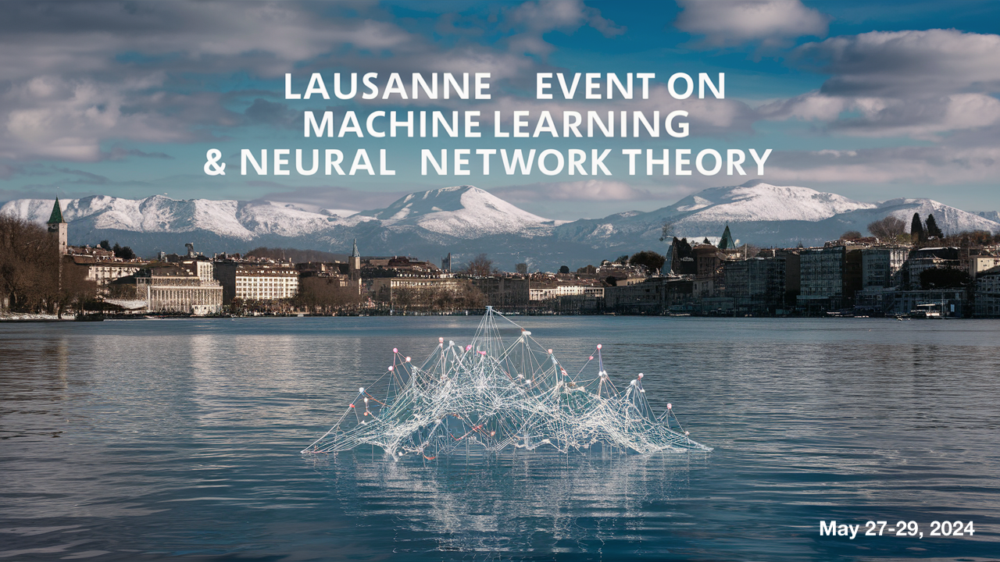

The past decade brought a revolution to machine learning: algorithms are now able to deal with tasks and amounts of data that seemed to be science fiction only a decade ago. The program will concentrate on theoretical aspect of machine learning and neural network, and their deep link with high-dimensional statistics, statistical physics, computer science. It will highlight discussions at the intersection of probablity theory, statistical physics, optimization and theoretical computer science.

__Organisers:__  Vittorio Erba (EPFL. Spoc lab.), Florent Krzakala (EPFL, IdePhics Lab.), and Bruno Loureiro (DI-ENS & CNRS)

# Schedule

<iframe src="https://calendar.google.com/calendar/embed?height=600&wkst=2&ctz=Europe%2FZurich&bgcolor=%23F09300&mode=WEEK&showNav=0&showDate=0&showTitle=0&showPrint=0&showCalendars=0&showTz=0&title=LEMAN-TH&src=Y2FyZ2VzZTIwMjNAZ21haWwuY29t&color=%23039BE5&dates=20240527%2F20240529" style="border:solid 1px #777" width="900" height="500" frameborder="0" scrolling="no"></iframe>

# Place : EPFL, Lausanne, <a href="https://plan.epfl.ch/?room=%3DBM%205202&dim_floor=5&lang=en&dim_lang=en&tree_groups=centres_nevralgiques_grp%2Cmobilite_acces_grp%2Crestauration_et_commerces_grp%2Censeignement%2Cservices_campus_grp%2Cequipements_grp&tree_group_layers_centres_nevralgiques_grp=&tree_group_layers_mobilite_acces_grp=metro&tree_group_layers_restauration_et_commerces_grp=&tree_group_layers_enseignement=guichet_etudiants&tree_group_layers_services_campus_grp=information_epfl&tree_group_layers_equipements_grp=&baselayer_ref=grp_backgrounds&map_x=2532969&map_y=1152553&map_zoom=12&to=BM%205202"> Room BM5202 </a>

# Registration
Register by filling [this Google forms](https://forms.gle/GvtEZg3ovQ8fWQPt9).

Registration is free but mandatory. Note that due to limited space, registration does not guarantee acceptance. We will be contacting participants individually.

# Invited speakers

Gerard Ben Arous (NYU)  
Raphael Berthier (Inria Sorbonne Université)  
Hugo Cui (EPFL)  
Alex Damian (Princeton)  
Yatin Dandi (EPFL)  
Edgar Dobriban (UPenn)  
Elvis Dohmatob (FAIR Paris)  
Ivan Dokmanic (Basel)  
Lenaic Chizat (EPFL)  
Nicolas Flammarion (EPFL)  
Cedric Gerbelot (NYU)  
Sebastian Goldt	(SISSA Trieste)  
Yue	Lu	(Harvard)  
Antoine Maillard  (ETHZ)  
Cengiz	Pehlevan (Harvard)  
Loucas Pillaud-Vivien	(Ecole des Ponts ParisTech)  
Federico Ricci-Tersenghi (Roma La Sapienza)  
Zohar Ringel (Hebrew University)  
Denny Wu (NYU)  
Lenka Zdeborová (EPFL)  
 

# List of Participants

TBA

# Many thanks to

