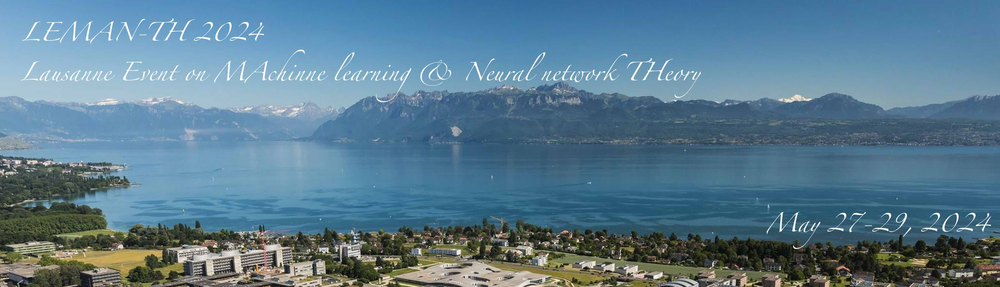

The past decade brought a revolution to machine learning: algorithms are now able to deal with tasks and amounts of data that seemed to be science fiction only a decade ago. The program will concentrate on theoretical aspect of machine learning and neural network, and their deep link with high-dimensional statistics, statistical physics, computer science.

__Organisers:__  Florent Krzakala (EPFL, IdePhics Lab.) and Bruno Loureiro (ENS, Paris)

# Schedule

# Invited speakers

Sebastian 	Goldt	(SISSA Trieste)  
Yue	Lu	(Harvard)  
Loucas Pillaud-Vivien	(Paris)  
Denny Wu (NYU)  
Lenka Zdeborova (EPFL)  

# List of Participants

# Registration

# Practical informations
