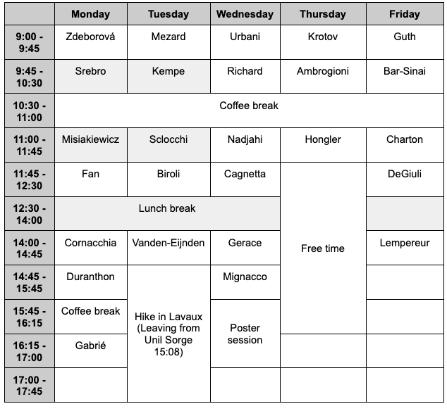

The past decade brought a revolution to machine learning: algorithms are now able to deal with tasks and amounts of data that seemed to be science fiction only a decade ago. The program will concentrate on theoretical aspect of machine learning and neural network, and their deep link with high-dimensional statistics, statistical physics and computer science. It will highlight discussions at the intersection of probablity theory, statistical physics, optimization and theoretical computer science.

__Organisers:__  Noam Itzhak Levi (AI4Science, EPFL) Matthieu Wyart (EPFL and Johns Hopkins University), Florent Krzakala (EPFL, IdePhics Lab.), and Bruno Loureiro (DI-ENS & CNRS)

# Schedule
Note that this is a preliminary schedule subjected to change.

# Venue :

[Bernoullli Center](https://bernoulli.epfl.ch/), EPFL, Lausanne.

# Registration

Register by filling this [Google forms](https://forms.gle/joyyivJtNdPmckWQA ).

Registration is free but mandatory. Note that due to limited space, registration does not guarantee acceptance. We will be contacting participants individually.

# Invited speakers

- Giulio Biroli (ENS)
- Florentin Guth (NYU)
- Dimitry Krotov (IBM)
- Clement Hongler (EPFL)
- Eric DeGiuli (Toronto Metropolitan)
- Theodor Misiakiewicz (Yale)
- Elisabetta Cornacchia (INRIA)
- Yohai Bar-Sinai (Tel Aviv)
- Marylou Gabrié (ENS)
- Luca Ambrogioni (Donder's)
- Francesca Mignacco (Princeton)
- Zhou Fan (Yale)
- Antonio Sclocchi (UCL)
- Gael Richard (Télécom Paris)
- Etienne Lempereur (ENS)
- Lenka Zdeborová (EPFL)
- Kimia Nadjahi (ENS)
- Nati Srebro (TTIC)
- Francesco Cagnetta (SISSA)
- Federica Gerace (Bologna)
- Marc Mézard (Bocconi)
- François Charton (META)
- Berfin Simsek (NYU)
- Eric Vanden-Eijnden (NYU & CFM)
- Julia Kempe (NYU & META)
- Pierfrancesco Urbani (IPhT)
